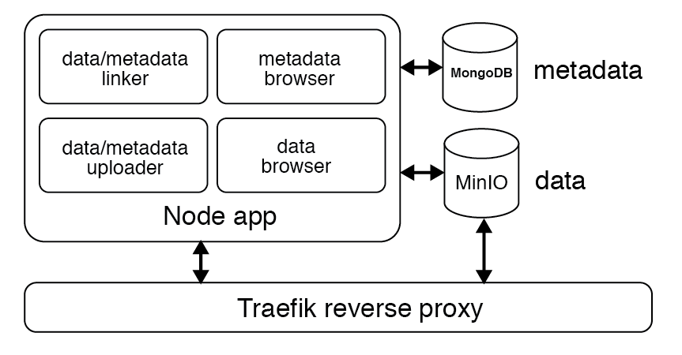

# Summary

``minimo`` is a linked data and metadata storage system for small labs. It combines object storage for large raw data with a document database for metadata. It is simple, low-overhead, and modern.

All too often we want to revisit data and struggle with a loss of context: old data is hard to find, hard to understand, hard to fuse. But if good hygiene is applied to the initial data commit process -- i.e., if raw data are stored alongside metadata capturing the context in which they were collected or created -- much of this trouble can be avoided. ``minimo`` encourages this sort of hygiene by providing a customizable interface for storing, linking, and accessing raw data and metadata. It sets the stage for reproducible science in the context of small labs that need a robust but lightweight solution to hygienic data storage.

Raw data and metadata should be inseparably linked. This is the central principle of ``minimo``.

# Statement of need

``minimo`` leverages existing open source solutions for data and metadata storage using modern development patterns, and it provides a lightweight web interface which abstracts the technical details of those solutions away from users. We use an **object storage system** for raw data, and a **document database** for metadata. It is designed to accomodate programmatic data access, to be portable across common infrastructure choices and operating systems, and to be deployable both locally and in the cloud.

``minimo`` consists of the following components:

1. A [MinIO](https://min.io/) server for raw data storage, because big, chunky data should live in immutable object storage.
2. A [MongoDB](https://www.mongodb.com/) server for metadata storage, because metadata are typically small and benefit greatly from database structure and semantics to allow efficient search and selection.
3. An [Express](https://expressjs.com/)/[Node](https://nodejs.org) server which provides a graphical user interface for uploading, linking, and accessing raw data and metadata.
4. A [Traefik](https://containo.us/traefik/) server which acts as a reverse proxy for the other three components.

{ width=65% }

For portability and ease of deployment, we've bundled all of these components as a [Docker](https://www.docker.com/) application. This means that ``minimo`` can be deployed on any common operating system (Linux, Windows, or Mac) simply by cloning its code from [GitHub](https://github.com/focolab/minimo), installing Docker and [Docker Compose](https://docs.docker.com/compose/install/), and running a single Docker command.

This architecture offers several key advantages: it supports very large raw data files, provides both easy human access and robust programmatic access to underlying data stores, allows for deployment on both local and cloud hardware, and is lightweight enough to be easily extensible and maintainable.

We use this in our lab [@Bubnis:2019] and share it to support reproducible and convenient data science.

# Acknowledgements

We thank the UCSF Weill Institute For Neurosciences for providing funding and support for this project.

This work was supported by NIH/NINDS grant NS115572 (R.L.D).

Thanks to Doug Flanzer for valuable discussion.

# References

---
nocite: | 
  @Docker, @Express, @MinIO, @MongoDB, @Node.js, @Traefik
...
